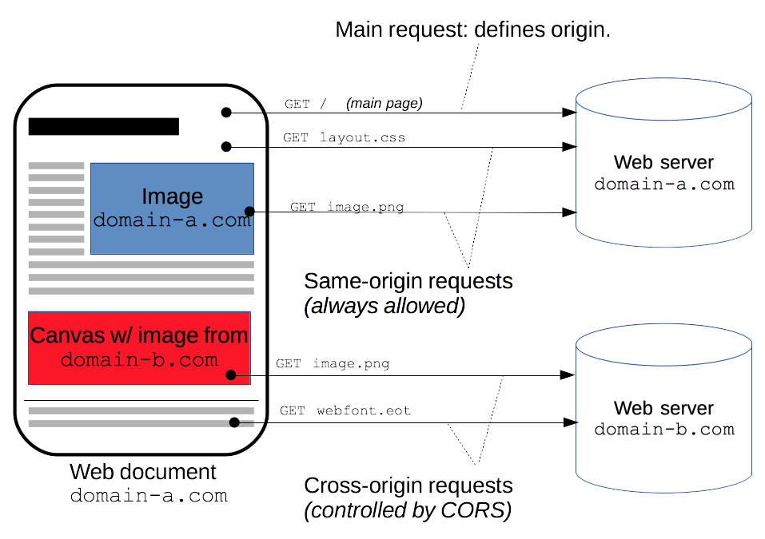
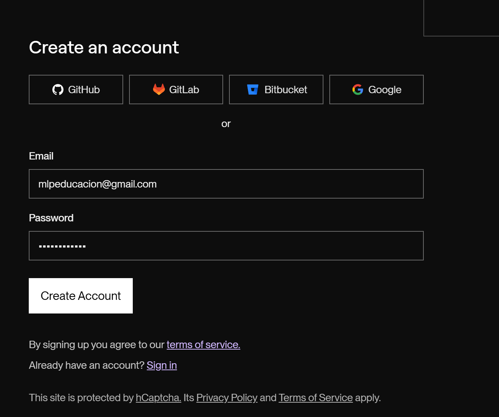
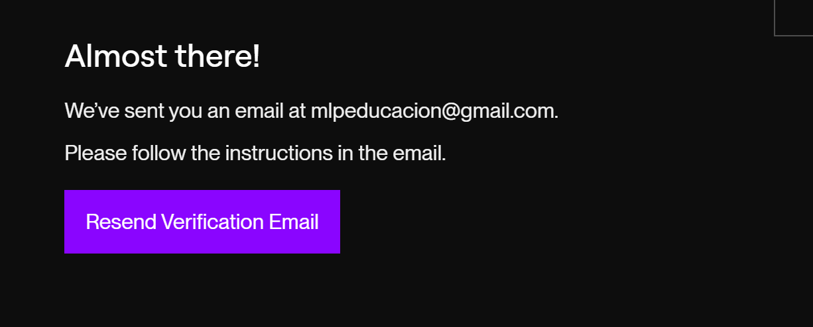
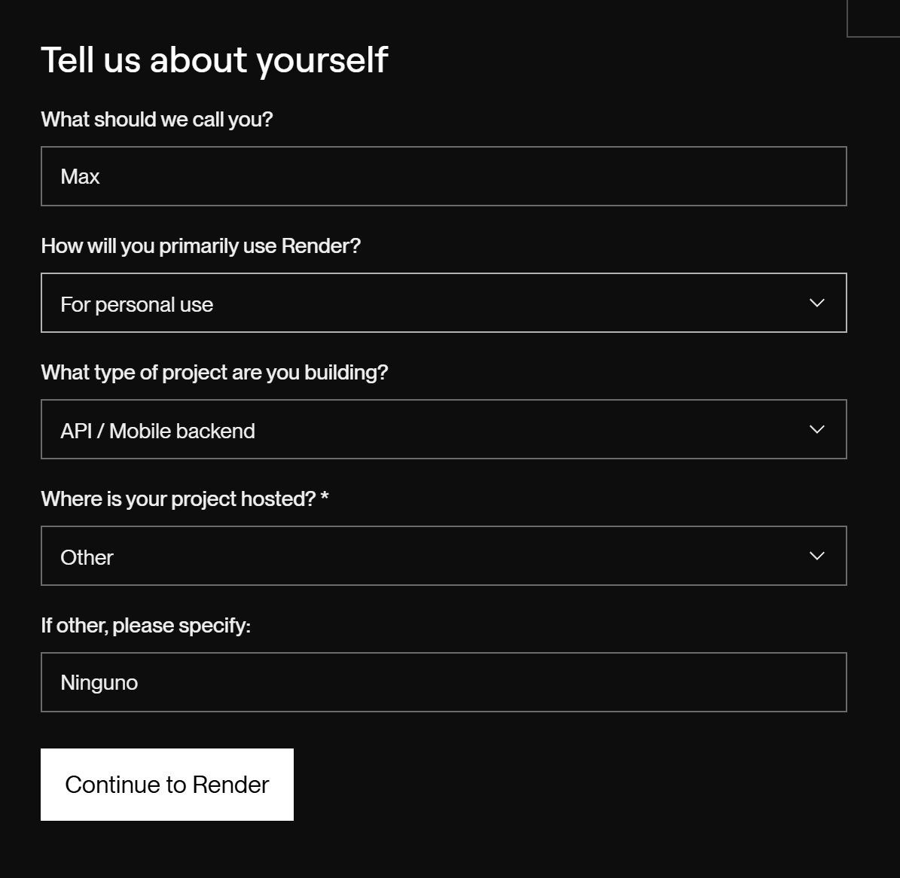
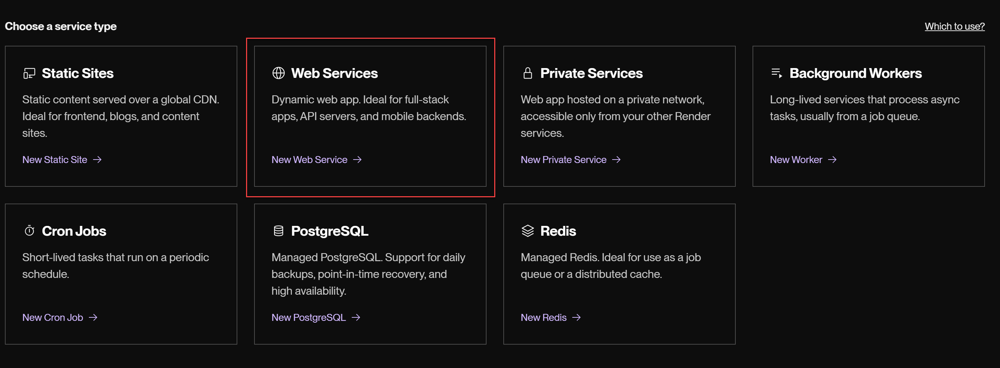
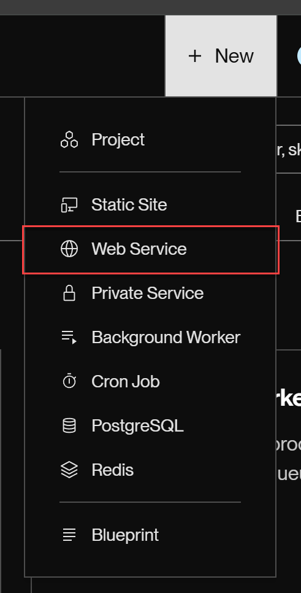

# Inicio rápido de proyecto Node

```sh
touch server.js README.md && npm init -y && npm i nodemon -D && npm i express cors
```

## Links


## CORS

<https://developer.mozilla.org/es/docs/Web/HTTP/CORS>




## Librería para solucionar el problema de cors

<https://www.npmjs.com/package/cors>

## Registro en RENDER para subir proyectos Node








